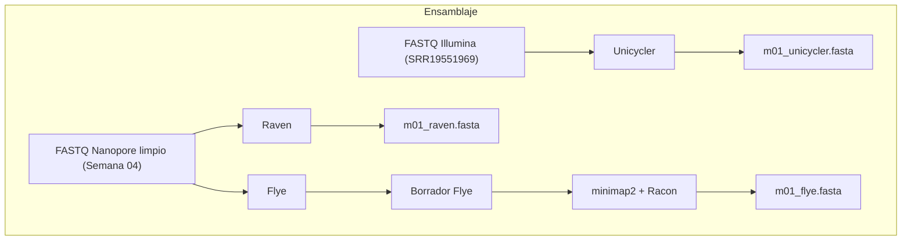
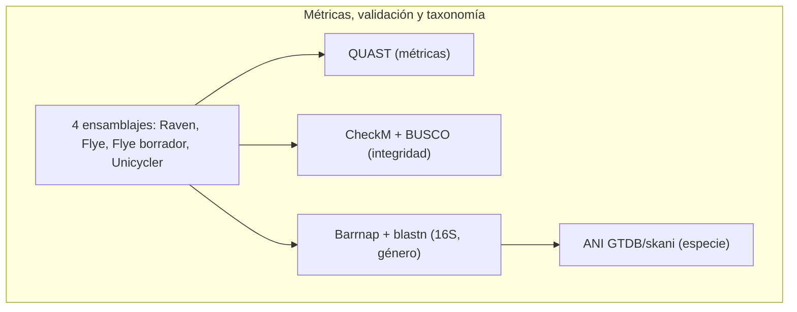

# Semana 05: Ensamblaje de genomas

## Logro de la sesión:

Al finalizar la sesión, el estudiante utiliza herramientas bioinformáticas para obtener un genoma ensamblado y evaluar su integridad.

## Estructura de la práctica:

1. Acceso al servidor de cómputo
2. Ensamblaje de genomas de datos de secuenciación Illumina
3. Ensamblaje de genomas de datos de secuenciación Nanopore
4. Obtención de las métricas de los genomas ensamblados
5. Clasificación taxonómica a nivel de género en base a la secuencia 16S
6. Validación de los genomas ensamblados
7. Clasificación taxonómica a nivel de especie mediante ANI (Average Nucleotide Identity)
8. Ensamblaje del genoma de los datos de secuenciación Nanopore generados en el curso

> **De la Semana 04 a la Semana 05:** en la práctica anterior obtuvo, para su barcode, un archivo `b<barcode>_sup_nanofilt.fastq.gz` (el FASTQ final de la limpieza recortado y filtrado por calidad/longitud) y un reporte de contaminación de Kraken2 (`b<barcode>.report`). Esta práctica parte de ese mismo archivo FASTQ: es la entrada para los ensambladores.

## Flujo de trabajo:

### Ensamblaje (secciones 2 y 3):



### Métricas, validación y taxonomía (secciones 4 a 7):



## Programas requeridos:

### Programas de acceso al servidor:

PuTTY v0.79 https://www.chiark.greenend.org.uk/~sgtatham/putty/latest.html
   - **Descripción:** PuTTY es un cliente SSH, Telnet y Rlogin gratuito y de código abierto para Windows y sistemas Unix. Se utiliza principalmente para establecer conexiones seguras de línea de comandos a servidores remotos.

WinSCP v6.1 https://winscp.net/eng/download.php
   - **Descripción:** WinSCP es un cliente SFTP, FTP, WebDAV, Amazon S3 y SCP gratuito y de código abierto para Windows. Permite la transferencia segura de archivos entre un ordenador local y servidores remotos mediante una interfaz gráfica de usuario.

### Programas bioinformáticos:

Bandage v0.8.1 http://rrwick.github.io/Bandage/
   - **Descripción:** Bandage es una herramienta para visualizar grafos de ensamblaje de genomas. Permite explorar las relaciones entre los contigs (fragmentos de ADN ensamblados) y puede ayudar a identificar problemas en el ensamblaje, como colapsos de repeticiones o errores. Su nombre es un acrónimo de "Bandage is a nice de novo assembly graph explorer".

Barrnap v0.9 https://github.com/tseemann/barrnap
   - **Descripción:** Barrnap (Bacterial rRNA prediction program) es un programa que predice las secuencias de ARN ribosomal (rRNA) en genomas bacterianos y arqueales. La identificación de los genes de rRNA es importante para estudios filogenéticos y metagenómicos.

BUSCO v6.1.0 https://busco.ezlab.org/
   - **Descripción:** BUSCO (Benchmarking Universal Single-Copy Orthologs) evalúa la completitud de un ensamblaje comparándolo contra un conjunto de genes ortólogos de copia única esperados para un linaje taxonómico. Desde la versión 6, las bases de datos de BUSCO usan el sufijo `_odb12.2`; con `busco --list-datasets` se puede ver el árbol completo de linajes disponibles y elegir uno tan específico como el género (de forma similar a como CheckM usa el género en `taxonomy_wf`). Es un estándar ampliamente citado en publicaciones para reportar completitud genómica, y en esta práctica se usa como validación complementaria a CheckM.

CheckM v1.2.2 https://ecogenomics.github.io/CheckM/
   - **Descripción:** CheckM es una herramienta que evalúa la calidad de los metagenomas ensamblados y de los genomas ensamblados a partir de metagenomas (MAGs). Proporciona estimaciones de completitud y contaminación basadas en marcadores genéticos.

Flye v2.9.2 https://github.com/fenderglass/Flye/
   - **Descripción:** Flye es un ensamblador de novo enfocado en lecturas largas. Se destaca por su velocidad y eficiencia en el uso de memoria, lo que lo hace adecuado para ensamblar genomas grandes en recursos computacionales limitados.

Minimap2 v2.29.0 https://github.com/lh3/minimap2
   - **Descripción:** es un alineador de secuencias rápido y versátil diseñado para alinear secuencias largas de ADN o ARN, como lecturas de Nanopore y PacBio contra genomas de referencia o ensamblajes, así como lecturas largas entre sí para el ensamblaje de novo y lecturas cortas contra genomas; se destaca por su velocidad, sensibilidad robusta frente a errores en lecturas largas, su formato de salida PAF y una amplia gama de opciones de personalización mediante indexación eficiente basada en minimizadores, siendo una herramienta fundamental para diversas tareas de análisis genómico.

Quast v5.2.0 http://quast.sourceforge.net/
   - **Descripción:** QUAST (Quality Assessment Tool for Genome Assemblies) es una herramienta que calcula una amplia variedad de métricas para evaluar la calidad de los ensamblajes de genomas. Proporciona estadísticas detalladas sobre la contigüidad, la precisión y la completitud del ensamblaje.

Racon v1.5.0 https://github.com/lbcb-sci/racon
   - **Descripción:** Racon es una herramienta para el pulido (polishing) de ensamblajes de genomas, especialmente aquellos generados a partir de lecturas largas. Utiliza las lecturas originales para corregir errores y mejorar la precisión del ensamblaje final.

Raven v1.8.3 https://github.com/lbcb-sci/raven
   - **Descripción:** Raven es un ensamblador de novo para lecturas largas no corregidas (Nanopore o PacBio), basado en una estrategia de solapamiento-capa-consenso (OLC) con pulido con Racon integrado (por defecto, 2 rondas). Es uno de los ensambladores más rápidos para genomas bacterianos a partir de datos Nanopore, junto con Flye, y en benchmarks publicados obtiene resultados comparables o mejores en contigüidad y precisión.

Unicycler v0.5.1 https://github.com/rrwick/Unicycler
   - **Descripción:** Unicycler es una herramienta bioinformática de código abierto diseñada para ensamblar genomas bacterianos (y otros genomas pequeños) a partir de datos de secuenciación. Su principal fortaleza radica en su capacidad para manejar conjuntos de datos híbridos, que combinan lecturas cortas y precisas (como las de Illumina) con lecturas largas que abarcan más distancia (como las de Oxford Nanopore o PacBio). Al aprovechar las ventajas de ambos tipos de datos, Unicycler puede generar ensamblajes más completos y contiguos, especialmente en regiones complejas como repeticiones. También puede ensamblar a partir de un solo tipo de datos (solo lecturas cortas o solo lecturas largas), como se hace en esta práctica.

### Herramientas bioinformáticas en línea:

GTDB https://gtdb.ecogenomic.org/
   - **Descripción:** Es un recurso que proporciona una clasificación taxonómica de procariotas (bacterias y arqueas) basada exclusivamente en la filogenia de genomas completos. Su objetivo es resolver las inconsistencias de la taxonomía tradicional (basada en el NCBI o LPSN) mediante el uso de un marco filogenómico estandarizado.

NCBI Datasets Genome https://www.ncbi.nlm.nih.gov/datasets/genome/
   - **Descripción:** Es la interfaz moderna y optimizada del National Center for Biotechnology Information para buscar, visualizar y descargar datos genómicos.

blastn https://blast.ncbi.nlm.nih.gov/Blast.cgi?PROGRAM=blastn&BLAST_SPEC=GeoBlast&PAGE_TYPE=BlastSearch
   - **Descripción:** BLASTn (Basic Local Alignment Search Tool - nucleotide) es una herramienta en línea del NCBI (National Center for Biotechnology Information) que permite buscar secuencias de nucleótidos (ADN o ARN) contra bases de datos de secuencias de nucleótidos. Encuentra regiones de similitud local entre tu secuencia de consulta y las secuencias en la base de datos, lo que te permite identificar secuencias relacionadas o similares.

## Metodología:

## 1. Acceso al servidor de cómputo:

### Abrir el programa PuTTY, colocar el hostname ( 10.142.250.66 ) y port ( 22 ), y dar clic en Open:


### En la terminal abierta, escribir su usuario y contraseña correspondiente para tener acceso al servidor de cómputo Tensor:
 


### Abrir el programa WinSCP, colocar el hostname ( 10.142.250.66 ) y port ( 22 ), escribir su usuario y contraseña correspondiente para tener acceso al servidor de cómputo Tensor, y hacer clic en Login:


### Crear la estructura de carpetas de trabajo

```bash
cd ~/genomics

mkdir -p assembly/{illumina,nanopore/{raven,flye}} validation/{checkm,busco} taxonomy

tree -L 2 ~/genomics
```

> **Comentario:**
> - Estas carpetas se crean **dentro de `~/genomics`**, la misma carpeta de trabajo de la Semana 04, para mantener juntos los datos crudos, la limpieza y el ensamblaje de cada barcode.
> - `contamination/` ya debería existir de la Semana 04 (ahí quedó el reporte de Kraken2); si no existe, `mkdir -p` la crea sin dar error.

## 2. Ensamblaje de genomas de datos de secuenciación Illumina

> **Nota:** Esta sección usa un conjunto de datos de ejemplo (SRR19551969) distinto al de su barcode, solo para practicar el ensamblaje con lecturas cortas. Los datos que usted ensambla con sus propios resultados son los de Nanopore (secciones 3 y 8).

```bash
cd ~/genomics/assembly/illumina

conda activate unicycler

unicycler -t 10 --kmers 21,51,71,91,111 -1 /data/2025_1/database/illumina/SRR19551969_R1.trim.fastq.gz -2 /data/2025_1/database/illumina/SRR19551969_R2.trim.fastq.gz -o m01_unicycler_illumina
```

> **Comentario:** 
> - `-t 10`: Estás pidiendo a Unicycler que utilice hasta 10 hilos (núcleos de CPU) para el proceso de ensamblaje. Esto puede ayudar a acelerar las cosas.
> - `--kmers 21,51,71,91,111`: Esta opción indica a Unicycler (que internamente usa SPAdes) la lista de tamaños de k-mero que debe probar durante el ensamblaje. Los k-meros son secuencias cortas de ADN que se utilizan para construir el grafo de ensamblaje. Probar varios tamaños a la vez a veces puede mejorar la calidad del ensamblaje, especialmente para genomas complejos.
> - `-1 /data/2025_1/database/illumina/SRR19551969_R1.trim.fastq.gz`: Esto especifica la ruta a tu primer archivo de lectura de extremo pareado (forward) en formato FASTQ (que también ha sido recortado). La extensión .gz indica que es un archivo comprimido con gzip, que Unicycler puede manejar directamente.
> - `-2 /data/2025_1/database/illumina/SRR19551969_R2.trim.fastq.gz`: Esto especifica la ruta a tu segundo archivo de lectura de extremo pareado (reverse), también en formato FASTQ recortado y comprimido con gzip.
> - `-o m01_unicycler_illumina`: Esto le dice a Unicycler que cree un nuevo directorio de salida llamado m01_unicycler_illumina donde se almacenarán todos los resultados del ensamblaje.

```bash
grep ">" m01_unicycler_illumina/assembly.fasta | head

>1 length=88087 depth=0.99x
>2 length=79583 depth=1.00x
>3 length=74306 depth=1.04x
>4 length=70204 depth=0.95x
>5 length=60964 depth=1.08x
>6 length=59828 depth=1.01x
>7 length=58389 depth=0.98x
>8 length=57436 depth=1.09x
>9 length=48846 depth=0.96x
>10 length=45933 depth=0.98x
```

> **Comentario:**
> - `length=`: longitud del contig en pares de bases.
> - `depth=`: profundidad relativa del contig respecto a la profundidad promedio de todo el ensamblaje (1.00x = profundidad promedio). Valores muy por debajo de 1x pueden indicar plásmidos de bajo número de copias; valores muy por encima de 1x, secuencias repetitivas colapsadas en un solo contig.
> - Con `head` se muestran solo los primeros 10 encabezados; el ensamblaje tiene más de 10 contigs. Esto es esperable: sin lecturas largas que atraviesen las regiones repetitivas, SPAdes/Unicycler no puede resolver el genoma en unos pocos contigs circulares, a diferencia de los ensamblajes de Nanopore de la sección 3 (3 contigs). Esta es una de las razones por las que se prefieren las lecturas largas para cerrar genomas bacterianos.

### Cambiar los nombres a los archivos .fasta y .gfa

```bash
mv m01_unicycler_illumina/assembly.fasta m01_unicycler.fasta

mv m01_unicycler_illumina/assembly.gfa m01_unicycler.gfa
```

### Exportar y visualizar el archivo .gfa en el programa bandage


## 3. Ensamblaje de genomas de datos de secuenciación Nanopore

Para los datos de Nanopore se comparan dos ensambladores de novo para lecturas largas: **Raven** y **Flye**. Ambos son rápidos y están entre los mejor evaluados en benchmarks publicados para genomas bacterianos con datos Nanopore.

```bash
cd ~/genomics/assembly/nanopore
```

### Ensamblaje de novo del genoma con Raven

```bash
cd ~/genomics/assembly/nanopore/raven

conda activate unicycler

raven -t 10 -p 2 --graphical-fragment-assembly m01_raven.gfa /data/2025_1/database/nanopore/fastq/m01_trim.fastq.gz > m01_raven.fasta
```

> **Comentario:** 
> - `conda activate unicycler`: Raven queda instalado en este mismo entorno.
> - `-t 10`: número de hilos.
> - `-p 2`: número de rondas de pulido con Racon que Raven aplica **internamente** sobre su propio ensamblaje (2 es el valor por defecto; se indica explícitamente para dejar constancia del parámetro usado). A diferencia de Flye, Raven no necesita un paso de pulido aparte: ya lo incluye.
> - `--graphical-fragment-assembly m01_raven.gfa`: además del FASTA, genera el grafo de ensamblaje en formato GFA, para visualizarlo en Bandage.
> - `/data/2025_1/database/nanopore/fastq/m01_trim.fastq.gz`: lecturas Nanopore de entrada.
> - `> m01_raven.fasta`: Raven escribe el ensamblaje en formato FASTA por la salida estándar; se redirige a un archivo. A diferencia de Unicycler o Flye, no crea una carpeta de salida ni archivos de log adicionales.

```bash
grep ">" m01_raven.fasta

>Utg2980 LN:i:6854 RC:i:54 XO:i:1
>Utg2982 LN:i:4872789 RC:i:1398 XO:i:1
>Utg2984 LN:i:133130 RC:i:32 XO:i:1
```

> **Comentario:**
> - `Utg####`: identificador del contig (unitig) que Raven asigna internamente; el número no es correlativo porque proviene de su grafo de solapamientos.
> - `LN:i:`: longitud del contig en pares de bases. Compare con los 3 contigs de Flye (sección siguiente): longitudes muy similares (6 862, 4 872 717 y 133 133 pb con Flye), lo que es una buena señal de consistencia entre ensambladores.
> - `RC:i:`: número de lecturas ("read count") que respaldan ese contig.
> - `XO:i:`: etiqueta interna de Raven, no documentada como estándar (a diferencia de `LN` y `RC`, que sí siguen la convención de GFA); no es necesario interpretarla para esta práctica.
> - Raven también genera un archivo `raven.cereal` en la misma carpeta: es una caché interna del programa (permite reanudar la ejecución con `--resume` si se interrumpe). No se usa en el resto de la práctica.

### Exportar y visualizar el archivo .gfa en el programa bandage


### Ensamblaje de novo del genoma con Flye

```bash
cd ~/genomics/assembly/nanopore/flye

conda activate shotgun

flye --nano-hq /data/2025_1/database/nanopore/fastq/m01_trim.fastq.gz --threads 10 --genome-size 5m --out-dir m01_flye_nanopore
```

> **Comentario:** 
> - `--nano-hq`: Indica que las lecturas son de alta precisión (basecalling con modelo `sup` y calidad Q20 o superior, como las obtenidas con Dorado en la Semana 04). Si las lecturas fueran de menor calidad, se usaría `--nano-raw`.
> - `--genome-size 5m`: A diferencia de Raven o Unicycler, Flye sí requiere una estimación del tamaño del genoma (aquí, 5 millones de pares de bases) para calcular la cobertura y ajustar sus parámetros internos.

```bash
tail -n 20 m01_flye_nanopore/flye.log

[2026-09-26 08:00:42] root: DEBUG:         4.0 M       repeat_graph_edges.fasta
[2026-09-26 08:00:42] root: DEBUG:         4.0 M       graph_before_rr.gfa
[2026-09-26 08:00:42] root: DEBUG:     00-assembly/
[2026-09-26 08:00:42] root: DEBUG:         97.0 B      draft_assembly.fasta.fai
[2026-09-26 08:00:42] root: DEBUG:         4.0 M       draft_assembly.fasta
[2026-09-26 08:00:42] root: DEBUG:     10-consensus/
[2026-09-26 08:00:42] root: DEBUG:         968.0 B     minimap.stderr
[2026-09-26 08:00:42] root: DEBUG:         265.0 K     minimap.bam.bai
[2026-09-26 08:00:42] root: DEBUG:         4.0 M       consensus.fasta
[2026-09-26 08:00:42] root: DEBUG: --------------------------
[2026-09-26 08:00:42] root: INFO: Assembly statistics:

        Total length:   5012708
        Fragments:      3
        Fragments N50:  4872715
        Largest frg:    4872715
        Scaffolds:      0
        Mean coverage:  157

[2026-09-26 08:00:42] root: INFO: Final assembly: /home/fguzman/genomics/assembly/nanopore/flye/m01_flye_nanopore/assembly.fasta
```

```bash
cat m01_flye_nanopore/assembly_info.txt 

#seq_name       length  cov.    circ.   repeat  mult.   alt_group       graph_path
contig_1        4872715 157     Y       N       1       *       1
contig_2        133133  180     Y       N       1       *       2
contig_3        6860    153     Y       N       1       *       3
```

> **Comentario:** 
> - `seq_name`: El identificador del contig. En este caso, contig_1, contig_2 y contig_3.
> - `length`: La longitud de cada contig en bases.
> - `cov.`: La profundidad estimada para cada contig, que indica cuántas veces, en promedio, cada base del contig fue cubierta por las lecturas de entrada. Una profundidad más alta generalmente indica una mayor confianza en la secuencia del contig.
> - `circ.`: Indica si el contig se predice que es circular (Y para sí, N para no). Esta es la evidencia de circularización de Flye (compárela con lo que observe en Bandage para el ensamblaje de Raven).
> - `repeat`: Indica si el contig se identificó como una región repetitiva (Y para sí, N para no).
> - `mult.`: Un factor que indica la multiplicidad estimada de la secuencia en el genoma. Un valor de 1 sugiere una única copia, mientras que valores mayores indican posibles repeticiones.
> - `alt_group`: Identifica grupos de contigs que representan posibles ensamblajes alternativos de la misma región genómica. Un * indica que no pertenece a ningún grupo alternativo. Todos los contigs tienen *, lo que sugiere que Flye no identificó ensamblajes alternativos significativos para estas regiones.
> - `graph_path`: El índice del camino en el grafo de ensamblaje que corresponde a este contig.

```bash
grep ">" m01_flye_nanopore/assembly.fasta

>contig_1
>contig_2
>contig_3
```

### Cambiar los nombres al borrador de Flye

```bash
mv m01_flye_nanopore/assembly.fasta m01_flye_draft.fasta

mv m01_flye_nanopore/assembly_graph.gfa m01_flye.gfa
```

> **Comentario:** Se le llama "borrador" (`_draft`) porque todavía no se ha pulido con Racon; el archivo `.gfa` sí se conserva con el nombre final, porque el pulido con Racon corrige bases, no cambia la topología del grafo.

> ### Exportar y visualizar el archivo .gfa en el programa bandage


### Pulido del ensamblaje de Flye con Racon

```bash
conda activate shotgun

minimap2 -x map-ont -t 10 m01_flye_draft.fasta /data/2025_1/database/nanopore/fastq/m01_trim.fastq.gz > m01_flye_racon1.paf

racon -t 10 /data/2025_1/database/nanopore/fastq/m01_trim.fastq.gz m01_flye_racon1.paf m01_flye_draft.fasta > m01_flye.fasta
```

> **Comentario:**
> - `minimap2 -x map-ont`: preajuste para alinear lecturas Nanopore **contra un ensamblaje o referencia** (a diferencia de `ava-ont`, que se usa para solapamientos lectura-contra-lectura). Aquí alinea las lecturas originales contra el borrador de Flye.
> - `-t 10`: hilos.
> - `m01_flye_draft.fasta`: el borrador de Flye, usado como referencia para el alineamiento.
> - `/data/2025_1/database/nanopore/fastq/m01_trim.fastq.gz`: las mismas lecturas que Flye usó para ensamblar.
> - `> m01_flye_racon1.paf`: alineamientos en formato PAF, que Racon necesita como entrada.
> - `racon -t 10 <lecturas> <alineamientos.paf> <borrador.fasta> > <salida.fasta>`: genera una nueva versión del ensamblaje en la que cada posición se corrige según el consenso de las lecturas alineadas ahí. Es el mismo tipo de pulido que Raven aplica internamente (`-p 2`) y que Unicycler aplica en su modo de solo lecturas largas; aquí se hace explícito para el ensamblaje de Flye.
> - `m01_flye.fasta`: el ensamblaje de Flye **ya pulido**, que se usará en el resto de la práctica (secciones 4 a 7).

> **Para profundizar (opcional):** puede repetir este proceso una segunda vez, usando `m01_flye.fasta` como nuevo borrador (`minimap2 ... m01_flye.fasta ...` → `racon ... m01_flye.fasta ... > m01_flye_r2.fasta`). Dos rondas de pulido son un punto de partida habitual en varios protocolos publicados. Compare con `seqkit stats` si la longitud total o el N50 cambiaron entre el borrador y la versión pulida.

## 4. Obtención de las métricas de los genomas ensamblados

```bash
cd ~/genomics/validation
```

### Cálculo de las métricas de los genomas ensamblados

```bash
quast.py -m 1000 -o m01_quast ~/genomics/assembly/nanopore/raven/m01_raven.fasta ~/genomics/assembly/nanopore/flye/m01_flye.fasta ~/genomics/assembly/nanopore/flye/m01_flye_draft.fasta ~/genomics/assembly/illumina/m01_unicycler.fasta
```

> **Comentario:** 
> - `-m 1000`: Esta opción establece la longitud mínima de contig para ser considerada en la evaluación a 1000 pares de bases. Solo los contigs que tengan al menos 1000 pares de bases de longitud se incluirán en el análisis. Esto filtra contigs cortos y potencialmente poco fiables.
> - QUAST recibe **cuatro** ensamblajes en el mismo comando, para compararlos lado a lado en un único reporte: Raven, Flye pulido con Racon, el **borrador de Flye sin pulir** (`m01_flye_draft.fasta`) y Unicycler (lecturas cortas, sección 2). Incluir el borrador junto al pulido permite ver el efecto concreto del pulido con Racon sobre las métricas; incluir Unicycler permite ver la diferencia entre ensamblar con lecturas largas y con lecturas cortas.

```bash
cat m01_quast/report.txt

All statistics are based on contigs of size >= 1000 bp, unless otherwise noted (e.g., "# contigs (>= 0 bp)" and "Total length (>= 0 bp)" include all contigs).

Assembly                    m01_raven  m01_flye   m01_flye_draft  m01_unicycler
# contigs (>= 0 bp)         3          3          3               547          
# contigs (>= 1000 bp)      3          3          3               322          
# contigs (>= 5000 bp)      3          3          3               206          
# contigs (>= 10000 bp)     2          2          2               149          
# contigs (>= 25000 bp)     2          2          2               52           
# contigs (>= 50000 bp)     2          2          2               8            
Total length (>= 0 bp)      5012773    5012586    5012708         4439058      
Total length (>= 1000 bp)   5012773    5012586    5012708         4360270      
Total length (>= 5000 bp)   5012773    5012586    5012708         4046946      
Total length (>= 10000 bp)  5005919    5005739    5005848         3607901      
Total length (>= 25000 bp)  5005919    5005739    5005848         2046124      
Total length (>= 50000 bp)  5005919    5005739    5005848         548797       
# contigs                   3          3          3               322          
Largest contig              4872789    4872621    4872715         88087        
Total length                5012773    5012586    5012708         4360270      
GC (%)                      55.30      55.30      55.30           50.95        
N50                         4872789    4872621    4872715         23263        
N90                         4872789    4872621    4872715         7432         
auN                         4740259.2  4740108.7  4740177.0       28173.1      
L50                         1          1          1               58           
L90                         1          1          1               186          
# N's per 100 kbp           0.00       0.00       0.00            0.00 
```

> **Comentario:** 
> - `contigs (>= X bp)`: Número de contigs mayores o iguales a X pares de bases. Esta métrica indica cuántas secuencias contiguas (contigs) tiene tu ensamblaje que cumplen con una longitud mínima específica (X). QUAST reporta esto para varios umbrales de longitud (0 bp, 1000 bp, 5000 bp, etc.). Un número menor de contigs más largos generalmente se considera un mejor ensamblaje, ya que indica una mayor contigüidad (menos fragmentación).
> - `Total length (>= X bp)`: Longitud total de los contigs mayores o iguales a X pares de bases. Similar a la métrica anterior, pero en lugar de contar, suma la longitud de todos los contigs que cumplen con el umbral de longitud especificado. La longitud total del ensamblaje debería ser cercana al tamaño esperado del genoma.
> - `contigs`: Este es el número total de contigs en el ensamblaje que tienen al menos 1000 pares de bases de longitud (esta es la convención predeterminada de QUAST para esta métrica).
> - `Largest contig`: La longitud del contig más largo en el ensamblaje. Un contig más largo es deseable, ya que sugiere que se han podido resolver regiones más complejas del genoma en una sola pieza.
> - `Total length`: La suma de las longitudes de todos los contigs en el ensamblaje que tienen al menos 1000 pares de bases de longitud (nuevamente, el comportamiento predeterminado de QUAST para esta métrica).
> - `GC (%)`: El porcentaje de bases guanina (G) y citosina (C) en el ensamblaje. Este valor suele ser característico de la especie o linaje que se está secuenciando y puede utilizarse para verificar la consistencia con otros ensamblajes o datos conocidos.
> - `N50`: Esta es una métrica clave para evaluar la contigüidad de un ensamblaje. Se define como la longitud del contig más corto en el conjunto de contigs cuya longitud acumulada representa al menos el 50% del tamaño total del ensamblaje. Un N50 más alto indica que una porción significativa del ensamblaje está contenida en contigs más largos, lo cual es generalmente mejor. Para entenderlo mejor: imagina ordenar todos tus contigs de mayor a menor longitud. El N50 es la longitud del contig en el punto donde, al sumar las longitudes de los contigs desde el más largo, alcanzas o superas la mitad del tamaño total del ensamblaje.
> - `L50`: El número de contigs cuya longitud es mayor o igual al N50. Un L50 más bajo es mejor, ya que significa que se necesita un número menor de contigs para alcanzar el 50% del tamaño del ensamblaje.
> - `N's per 100 kbp`: La cantidad de bases 'N' (que representan bases desconocidas o ambiguas) en el ensamblaje, normalizada por cada 100,000 pares de bases. Un valor más bajo es mejor, ya que indica una mayor resolución de la secuencia.

> **Punto de control:** Con la tabla de QUAST más el `assembly_info.txt` de Flye y lo observado en Bandage para Raven, decida cuál ensamblaje usará como referencia en las secciones 5 a 7 (normalmente Raven o Flye pulido, por menor número de contigs, mayor N50 y más contigs circularizados). Compare además `m01_flye` con `m01_flye_draft` para comentar el efecto del pulido con Racon, y `m01_raven`/`m01_flye` con `m01_unicycler` para comentar la diferencia entre ensamblar con lecturas largas y con lecturas cortas.

## 5. Clasificación taxonómica a nivel de género en base a la secuencia 16S

```bash
cd ~/genomics/taxonomy
```

### Identificación de las secuencias de rRNA

```bash
conda activate genome

barrnap ~/genomics/assembly/nanopore/flye/m01_flye.fasta --threads 10 --outseq m01_rna.fasta
```

> **Comentario:**
> - `~/genomics/assembly/nanopore/flye/m01_flye.fasta`: genoma ensamblado en el que Barrnap buscará genes de rRNA. Use el ensamblaje que eligió en el punto de control de la sección 4 (Raven o Flye pulido); si eligió Raven, la ruta sería `~/genomics/assembly/nanopore/raven/m01_raven.fasta`.
> - `--threads 10`: número de hilos que usará Barrnap.
> - `--outseq m01_rna.fasta`: archivo FASTA de salida con las secuencias de rRNA encontradas (16S, 23S y 5S).

```bash
grep ">" m01_rna.fasta

>16S_rRNA::contig_1:1506005-1507543(+)
>16S_rRNA::contig_1:1106332-1107870(-)
>16S_rRNA::contig_1:1613658-1615196(+)
>16S_rRNA::contig_1:1217281-1218819(-)
>16S_rRNA::contig_1:3446-4984(-)
>16S_rRNA::contig_1:784671-786209(-)
>16S_rRNA::contig_1:1026364-1027900(-)
>16S_rRNA::contig_1:2122071-2123607(+)
>23S_rRNA::contig_1:2124121-2127023(+)
>23S_rRNA::contig_1:187-3090(-)
>23S_rRNA::contig_1:1615550-1618452(+)
>23S_rRNA::contig_1:781412-784315(-)
>23S_rRNA::contig_1:1102983-1105885(-)
>23S_rRNA::contig_1:1214023-1216925(-)
>23S_rRNA::contig_1:1507754-1510657(+)
>23S_rRNA::contig_1:1023015-1025917(-)
>5S_rRNA::contig_1:780977-781088(-)
>5S_rRNA::contig_1:1510732-1510843(+)
>5S_rRNA::contig_1:1618531-1618642(+)
>5S_rRNA::contig_1:2127101-2127212(+)
>5S_rRNA::contig_1:781226-781337(-)
>5S_rRNA::contig_1:1022829-1022940(-)
>5S_rRNA::contig_1:1102793-1102904(-)
>5S_rRNA::contig_1:1213833-1213944(-)
>5S_rRNA::contig_1:6-108(-)
```

> **Comentario:** El genoma tiene **8 copias** del gen 16S (uno de los marcadores más usados en identificación bacteriana), lo cual es normal: las bacterias suelen tener varios operones de rRNA casi idénticos entre sí. **No es necesario analizar las 8**: basta con elegir una (por ejemplo, la primera) para la identificación taxonómica del siguiente paso.

```bash
head -n 5 m01_rna.fasta

>16S_rRNA::contig_1:1506005-1507543(+)
TTGAAGAGTTTGATCATGGCTCAGATTGAACGCTGGCGGCAGGCCTAACACATGCAAGTCGAGCGGCAGCGGGAAGTAGCTTGCTACTTTGCCGGCGAGCGGCGGACGGGTGAGTAATGTCTGGGAAACTGCCTGATGGAGGGGGATAACTACTGGAAACGGTAGCTAATACCGCATAATGTCGCAAGACCAAAGAGGGGGACCTTCGGGCCTCTTGCCATCAGATGTGCCCAGATGGGATTAGCTAGTAGGTGGGGTAATGGCTCACCTAGGCGACGATCCCTAGCTGGTCTGAGAGGATGACCAGCCACACTGGAACTGAGACACGGTCCAGACTCCTACGGGAGGCAGCAGTGGGGAATATTGCACAATGGGCGCAAGCCTGATGCAGCCATGCCGCGTGTATGAAGAAGGCCTTCGGGTTGTAAAGTACTTTCAGCGGGGAGGAAGGTGCTGAGGTTAATAACCTCAGCAATTGACGTTACCCGCAGAAGAAGCACCGGCTAACTCCGTGCCAGCAGCCGCGGTAATACGGAGGGTGCAAGCGTTAATCGGAATTACTGGGCGTAAAGCGCACGCAGGCGGTCTGTCAAGTCGGATGTGAAATCCCCGGGCTCAACCTGGGAACTGCATTCGAAACTGGCAGGCTAGAGTCTTGTAGAGGGGGGTAGAATTCCAGGTGTAGCGGTGAAATGCGTAGAGATCTGGAGGAATACCGGTGGCGAAGGCGGCCCCCTGGACAAAGACTGACGCTCAGGTGCGAAAGCGTGGGGAGCAAACAGGATTAGATACCCTGGTAGTCCACGCCGTAAACGATGTCGACTTGGAGGTTGTGCCCTTGAGGCGTGGCTTCCGGAGCTAACGCGTTAAGTCGACCGCCTGGGGAGTACGGCCGCAAGGTTAAAACTCAAATGAATTGACGGGGGCCCGCACAAGCGGTGGAGCATGTGGTTTAATTCGATGCAACGCGAAGAACCTTACCTACTCTTGACATCCAGAGAACTTTCCAGAGATGGATTGGTGCCTTCGGGAACTCTGAGACAGGTGCTGCATGGCTGTCGTCAGCTCGTGTTGTGAAATGTTGGGTTAAGTCCCGCAACGAGCGCAACCCTTATCCTTTGTTGCCAGCGGTTCGGCCGGGAACTCAAAGGAGACTGCCAGTGATAAACTGGAGGAAGGTGGGGATGACGTCAAGTCATCATGGCCCTTACGAGTAGGGCTACACACGTGCTACAATGGCGCATACAAAGAGAAGCGACCTCGCGAGAGCAAGCGGACCTCATAAAGTGCGTCGTAGTCCGGATTGGAGTCTGCAACTCGACTCCATGAAGTCGGAATCGCTAGTAATCGTAGATCAGAATGCTACGGTGAATACGTTCCCGGGCCTTGTACACACCGCCCGTCACACCATGGGAGTGGGTTGCAAAAGAAGTAGGTAGCTTAACCTTCGGGAGGGCGCTTACCACTTTGTGATTCATGACTGGGGTGAAGTCGTAACAAGGTAACCGTAGGGGAACCTGCGGTTGGATCACCTCCTT
>16S_rRNA::contig_1:1106332-1107870(-)
TTGAAGAGTTTGATCATGGCTCAGATTGAACGCTGGCGGCAGGCCTAACACATGCAAGTCGAGCGGCAGCGGGAAGTAGCTTGCTACTTTGCCGGCGAGCGGCGGACGGGTGAGTAATGTCTGGGAAACTGCCTGATGGAGGGGGATAACTACTGGAAACGGTAGCTAATACCGCATAATGTCGCAAGACCAAAGAGGGGGACCTTCGGGCCTCTTGCCATCAGATGTGCCCAGATGGGATTAGCTAGTAGGTGGGGTAATGGCTCACCTAGGCGACGATCCCTAGCTGGTCTGAGAGGATGACCAGCCACACTGGAACTGAGACACGGTCCAGACTCCTACGGGAGGCAGCAGTGGGGAATATTGCACAATGGGCGCAAGCCTGATGCAGCCATGCCGCGTGTATGAAGAAGGCCTTCGGGTTGTAAAGTACTTTCAGCGGGGAGGAAGGTGCTGAGGTTAATAACCTCAGCAATTGACGTTACCCGCAGAAGAAGCACCGGCTAACTCCGTGCCAGCAGCCGCGGTAATACGGAGGGTGCAAGCGTTAATCGGAATTACTGGGCGTAAAGCGCACGCAGGCGGTCTGTCAAGTCGGATGTGAAATCCCCGGGCTCAACCTGGGAACTGCATTCGAAACTGGCAGGCTAGAGTCTTGTAGAGGGGGGTAGAATTCCAGGTGTAGCGGTGAAATGCGTAGAGATCTGGAGGAATACCGGTGGCGAAGGCGGCCCCCTGGACAAAGACTGACGCTCAGGTGCGAAAGCGTGGGGAGCAAACAGGATTAGATACCCTGGTAGTCCACGCCGTAAACGATGTCGACTTGGAGGTTGTGCCCTTGAGGCGTGGCTTCCGGAGCTAACGCGTTAAGTCGACCGCCTGGGGAGTACGGCCGCAAGGTTAAAACTCAAATGAATTGACGGGGGCCCGCACAAGCGGTGGAGCATGTGGTTTAATTCGATGCAACGCGAAGAACCTTACCTACTCTTGACATCCAGAGAACTTTCCAGAGATGGATTGGTGCCTTCGGGAACTCTGAGACAGGTGCTGCATGGCTGTCGTCAGCTCGTGTTGTGAAATGTTGGGTTAAGTCCCGCAACGAGCGCAACCCTTATCCTTTGTTGCCAGCGGTTCGGCCGGGAACTCAAAGGAGACTGCCAGTGATAAACTGGAGGAAGGTGGGGATGACGTCAAGTCATCATGGCCCTTACGAGTAGGGCTACACACGTGCTACAATGGCGCATACAAAGAGAAGCGACCTCGCGAGAGCAAGCGGACCTCATAAAGTGCGTCGTAGTCCGGATTGGAGTCTGCAACTCGACTCCATGAAGTCGGAATCGCTAGTAATCGTAGATCAGAATGCTACGGTGAATACGTTCCCGGGCCTTGTACACACCGCCCGTCACACCATGGGAGTGGGTTGCAAAAGAAGTAGGTAGCTTAACCTTCGGGAGGGCGCTTACCACTTTGTGATTCATGACTGGGGTGAAGTCGTAACAAGGTAACCGTAGGGGAACCTGCGGTTGGATCACCTCCTT
```

> **Comentario:** Muestra el encabezado y la secuencia de las primeras copias del 16S; la primera es la secuencia que se usará en BLASTn.

### Realizar la identificación taxonómica de la cepa utilizando como referencia la secuencia 16S identificada previamente usando blastn del NCBI


### Revisar los alineamientos y establecer la taxonomía de la cepa en base al 16S


### Buscar genomas de referencia en https://www.ncbi.nlm.nih.gov/datasets/genome/


## 6. Validación de los genomas ensamblados

```bash
cd ~/genomics/validation/checkm

mkdir m01_fasta
```

### Copiar los genomas en el directorio m01_fasta

```bash
cp ~/genomics/assembly/nanopore/flye/m01_flye.fasta ~/genomics/assembly/nanopore/flye/m01_flye_draft.fasta ~/genomics/assembly/nanopore/raven/m01_raven.fasta ~/genomics/assembly/illumina/m01_unicycler.fasta m01_fasta
```

### Validación de los genomas ensamblados con CheckM

```bash
conda activate checkm

checkm taxonomy_wf -t 10 -x fasta genus Enterobacter m01_fasta . > m01_checkm_enterobacter.txt
```

> **Comentario:** 
> - `taxonomy_wf`: Es el flujo de trabajo basado en taxonomía. En lugar de buscar marcadores universales de bacterias o arqueas, utiliza un conjunto de genes que son específicos y conservados para el taxón que tú definas.
> - `genus Enterobacter`: rango taxonómico y género de los marcadores a usar. **Reemplácelo por el género que identificó con la secuencia 16S** en la sección 5; en este ejemplo el organismo era del género *Enterobacter*.
> - `-x fasta`: Especifica el formato de los archivos de entrada. En este caso, los archivos de entrada son genomas ensamblados en formato FASTA.
> - `m01_fasta`: Es el directorio de entrada donde se encuentran los archivos FASTA de los genomas que se van a evaluar (ahora cuatro: Raven, Flye pulido, Flye sin pulir y Unicycler). CheckM buscará en este directorio todos los archivos con extensión ".fasta" y los analizará.
> - `.`: Indica el directorio de salida. En este caso, los resultados se guardarán en el directorio actual.
> - `m01_checkm_enterobacter.txt`: Es el nombre del archivo donde se guardará la salida del análisis de CheckM.

> A modo de referencia sobre **cómo leer** este reporte, aquí tiene un ejemplo de una comparación anterior entre Flye y Unicycler (sin Raven ni el borrador de Flye). Su propio reporte tendrá el mismo formato, pero con **cuatro filas** (m01_raven, m01_flye, m01_flye_draft, m01_unicycler) y valores distintos:

```bash
tail -n 10 m01_checkm_enterobacter.txt

-----------------------------------------------------------------------------------------------------------------------------------------------------------------
  Bin Id            Marker lineage    # genomes   # markers   # marker sets   0     1     2    3   4   5+   Completeness   Contamination   Strain heterogeneity  
-----------------------------------------------------------------------------------------------------------------------------------------------------------------
  m01_flye_draft   Enterobacter (5)       13         1338          370        4    1330   4    0   0   0       99.76            0.48               0.00          
  m01_raven        Enterobacter (5)       13         1338          370        5    1329   4    0   0   0       99.57            0.48               0.00          
  m01_flye         Enterobacter (5)       13         1338          370        6    1328   4    0   0   0       99.40            0.48               0.00          
  m01_unicycler    Enterobacter (5)       13         1338          370        45   1260   31   2   0   0       91.49            2.98               8.11          
-----------------------------------------------------------------------------------------------------------------------------------------------------------------
```

> **Comentario:** 
> - `Bin Id`: Identificador del ensamblaje del genoma.
> - `Marker lineage`: Linaje del marcador utilizado para la evaluación. 
> - `# genomes`: Número de genomas de referencia utilizados en la evaluación.
> - `# markers`: Número total de marcadores genéticos (genes) usados en la evaluación.
> - `# marker sets`: Número de conjuntos de marcadores usados.
> - `0, 1, 2, 3, 4, 5+`: Distribución de los marcadores en los conjuntos.
> - `Completeness`: Porcentaje de marcadores esperados que se encontraron en el ensamblaje. Un valor alto indica un ensamblaje más completo.
> - `Contamination`: Porcentaje de marcadores duplicados o inesperados, lo que sugiere posible contaminación. Un valor bajo es mejor.
> - `Strain heterogeneity`: Indica la posible presencia de múltiples cepas en el ensamblaje. Un valor alto sugiere heterogeneidad.
>
> **Referencia orientativa (estándar Minimum Information about a Metagenome-Assembled Genome, MIMAG):** un genoma con completitud > 90 % y contaminación < 5 % se considera de alta calidad; con completitud ≥ 99 % y contaminación ≤ 1 %, casi completo. Compare estos valores entre los cuatro ensamblajes para decidir cuál conservar; observe en particular si el borrador sin pulir (`m01_flye_draft`) muestra más contaminación o menor completitud que la versión pulida (`m01_flye`), y si Unicycler (fragmentado en muchos contigs cortos) se comporta distinto a los ensamblajes de lecturas largas.

### Validación adicional con BUSCO

Como complemento a CheckM, BUSCO evalúa la completitud contra un conjunto de genes ortólogos de copia única. A partir de la v6, BUSCO organiza sus bases de datos en un árbol taxonómico (`_odb12.2`): conviene elegir el nivel más específico posible que coincida con el género identificado en la sección 5, en vez del linaje genérico `bacteria_odb12.2`.

```bash
cd ~/genomics/validation/busco

conda activate busco
```

```bash
busco --list-datasets

Datasets available to be used with BUSCO v6.1.0 and later (numbers in brackets indicate the number of marker gene profiles):

- archaea_odb12.2 [195]
    - euryarchaeota_odb12.2 [282]
        - methanomicrobia_odb12.2 [589]
            - methanosarcinaceae_odb12.2 [971]
            - methanosarcina_odb12.2 [1620]
            - methanomicrobiales_odb12.2 [819]
               - methanomicrobiaceae_odb12.2 [993]
        - halobacteria_odb12.2 [807]
            - halobacteriales_odb12.2 [909]
                - halobacteriaceae_odb12.2 [975]
                - haloarculaceae_odb12.2 [1058]
                    - haloarcula_odb12.2 [2575]
            - natrialbaceae_odb12.2 [1386]
                - natrinema_odb12.2 [2207]
                - haloterrigena_odb12.2 [1889]
            - haloferacales_odb12.2 [1023]
                - haloferacaceae_odb12.2 [1225]
                    - halorubrum_odb12.2 [1677]
                    - haloferax_odb12.2 [2202]
        - methanococcales_odb12.2 [988]
            - methanococcaceae_odb12.2 [1155]
        - methanobacteria_odb12.2 [786]
            - methanobrevibacter_odb12.2 [976]
            - methanobacterium_odb12.2 [1164]
        - thermococcaceae_odb12.2 [1133]
            - thermococcus_odb12.2 [1096]
    - thermoplasmata_odb12.2 [367]
    - nitrososphaerota_odb12.2 [787]
        - nitrosopumilales_odb12.2 [1304]
            - nitrosopumilus_odb12.2 [1334]
    - thermoprotei_odb12.2 [345]
        - sulfolobales_odb12.2 [1210]
        - thermoproteales_odb12.2 [477]
            - thermoproteaceae_odb12.2 [800]
        - desulfurococcales_odb12.2 [443]
            - desulfurococcaceae_odb12.2 [480]
- bacteria_odb12.2 [116]
    - delta-epsilon_subdivisions_odb12.2 [199]
        - deltaproteobacteria_odb12.2 [233]
    - acidobacteriota_odb12.2 [742]
        - acidobacteriaceae_odb12.2 [1174]
    - synergistota_odb12.2 [550]
    - fusobacteriota_odb12.2 [392]
        - fusobacteriaceae_odb12.2 [639]
            - fusobacterium_odb12.2 [774]
        - leptotrichia_odb12.2 [896]
    - campylobacterota_odb12.2 [623]
        - arcobacter_odb12.2 [1166]
    - spirochaetota_odb12.2 [205]
        - leptospiraceae_odb12.2 [1585]
        - brachyspira_odb12.2 [1343]
        - spirochaetales_odb12.2 [271]
            - treponema_odb12.2 [633]
            - borreliaceae_odb12.2 [762]
            - spirochaetaceae_odb12.2 [379]
    - desulfuromonadales_odb12.2 [626]
    - geobacteraceae_odb12.2 [783]
        - geobacter_odb12.2 [1043]
    - desulfovibrionales_odb12.2 [729]
    - desulfobacterales_odb12.2 [461]
        - desulfobacteraceae_odb12.2 [662]
    - thermotogota_odb12.2 [548]
    - aquificae_odb12.2 [507]
    - mycoplasmatota_odb12.2 [157]
        - mycoplasmatales_odb12.2 [205]
            - mycoplasma_odb12.2 [235]
        - acholeplasmataceae_odb12.2 [207]
            - phytoplasma_odb12.2 [202]
        - entomoplasmatales_odb12.2 [330]
            - spiroplasma_odb12.2 [366]
    - actinomycetota_odb12.2 [238]
        - coriobacteriia_odb12.2 [421]
            - collinsella_odb12.2 [815]
            - atopobiaceae_odb12.2 [562]
                - olsenella_odb12.2 [708]
            - eggerthellaceae_odb12.2 [686]
        - actinomycetes_odb12.2 [355]
            - frankia_odb12.2 [1256]
            - streptosporangiales_odb12.2 [890]
                - nocardiopsaceae_odb12.2 [1398]
                    - nocardiopsis_odb12.2 [1698]
                - actinomadura_odb12.2 [1520]
            - kitasatosporales_odb12.2 [966]
                - streptacidiphilus_odb12.2 [1717]
                - kitasatospora_odb12.2 [1897]
                - streptomyces_odb12.2 [1438]
            - pseudonocardiaceae_odb12.2 [954]
                - pseudonocardia_odb12.2 [1277]
                - amycolatopsis_odb12.2 [1831]
            - propionibacteriales_odb12.2 [558]
                - aeromicrobium_odb12.2 [1179]
                - nocardioides_odb12.2 [1132]
                - propionibacteriaceae_odb12.2 [689]
            - micromonosporaceae_odb12.2 [1151]
                - actinoplanes_odb12.2 [1983]
            - mycobacteriales_odb12.2 [777]
                - gordonia_odb12.2 [1657]
                - nocardiaceae_odb12.2 [1206]
                    - rhodococcus_odb12.2 [1635]
                    - nocardia_odb12.2 [1646]
                - mycobacteriaceae_odb12.2 [1275]
                    - mycolicibacterium_odb12.2 [1712]
                    - mycobacterium_odb12.2 [1512]
                - corynebacterium_odb12.2 [995]
            - micrococcales_odb12.2 [504]
                - microbacteriaceae_odb12.2 [621]
                    - leucobacter_odb12.2 [915]
                    - microbacterium_odb12.2 [1023]
                    - agromyces_odb12.2 [1307]
                    - curtobacterium_odb12.2 [1506]
                    - leifsonia_odb12.2 [964]
                - intrasporangiaceae_odb12.2 [914]
                - brachybacterium_odb12.2 [1212]
                - brevibacterium_odb12.2 [1183]
                - cellulomonadaceae_odb12.2 [968]
                - micrococcaceae_odb12.2 [740]
                    - kocuria_odb12.2 [1130]
                    - arthrobacter_odb12.2 [1050]
            - bifidobacteriaceae_odb12.2 [669]
                - bifidobacterium_odb12.2 [783]
            - actinomycetaceae_odb12.2 [582]
                - actinomyces_odb12.2 [786]
    - chloroflexota_odb12.2 [254]
    - cyanobacteriota_odb12.2 [719]
        - leptolyngbya_odb12.2 [1172]
        - synechococcales_odb12.2 [667]
            - prochlorococcus_odb12.2 [1128]
            - synechococcaceae_odb12.2 [905]
        - oscillatoriales_odb12.2 [1184]
        - chroococcales_odb12.2 [1121]
        - nostocales_odb12.2 [1434]
            - nostoc_odb12.2 [2036]
    - thermaceae_odb12.2 [977]
        - meiothermus_odb12.2 [1449]
        - thermus_odb12.2 [1318]
    - deinococcus_odb12.2 [1137]
    - bacillota_odb12.2 [201]
        - bacilli_odb12.2 [295]
            - lactobacillales_odb12.2 [367]
                - enterococcaceae_odb12.2 [714]
                    - enterococcus_odb12.2 [983]
                - lactobacillaceae_odb12.2 [519]
                    - weissella_odb12.2 [732]
                    - lactobacillus_odb12.2 [487]
                    - pediococcus_odb12.2 [970]
                - carnobacteriaceae_odb12.2 [538]
                    - carnobacterium_odb12.2 [964]
                - aerococcaceae_odb12.2 [603]
                - streptococcaceae_odb12.2 [689]
            - bacillales_odb12.2 [429]
                - staphylococcaceae_odb12.2 [809]
                    - salinicoccus_odb12.2 [1182]
                    - staphylococcus_odb12.2 [1317]
                - exiguobacterium_odb12.2 [1779]
                - alicyclobacillaceae_odb12.2 [665]
                    - alicyclobacillus_odb12.2 [962]
                - paenibacillaceae_odb12.2 [680]
                    - brevibacillus_odb12.2 [1891]
                    - paenibacillus_odb12.2 [946]
                - listeriaceae_odb12.2 [1142]
                    - listeria_odb12.2 [1431]
                - planococcaceae_odb12.2 [855]
                    - sporosarcina_odb12.2 [1346]
                    - planococcus_odb12.2 [1491]
                - bacillaceae_odb12.2 [617]
                    - virgibacillus_odb12.2 [1304]
                    - lysinibacillus_odb12.2 [1416]
                    - oceanobacillus_odb12.2 [1102]
                    - bacillus_odb12.2 [778]
        - selenomonadales_odb12.2 [586]
            - selenomonadaceae_odb12.2 [747]
                - selenomonas_odb12.2 [937]
        - veillonellaceae_odb12.2 [598]
            - megasphaera_odb12.2 [956]
            - veillonella_odb12.2 [1034]
        - erysipelotrichaceae_odb12.2 [444]
        - clostridia_odb12.2 [233]
            - thermoanaerobacterales_odb12.2 [438]
            - eubacteriales_odb12.2 [240]
                - clostridiaceae_odb12.2 [389]
                - desulfosporosinus_odb12.2 [1189]
                - ruminococcus_odb12.2 [484]
                - peptococcaceae_odb12.2 [506]
                - eubacteriaceae_odb12.2 [377]
                - peptostreptococcaceae_odb12.2 [416]
                - lachnospiraceae_odb12.2 [444]
                    - butyrivibrio_odb12.2 [1031]
                    - blautia_odb12.2 [1047]
                    - lachnoclostridium_odb12.2 [548]
        - tissierellia_odb12.2 [379]
            - anaerococcus_odb12.2 [839]
            - peptoniphilus_odb12.2 [692]
    - bacteroidota-chlorobiota_group_odb12.2 [362]
        - cytophagia_odb12.2 [691]
            - cytophagaceae_odb12.2 [856]
            - cyclobacteriaceae_odb12.2 [1336]
                - algoriphagus_odb12.2 [1755]
            - hymenobacteraceae_odb12.2 [1140]
                - hymenobacter_odb12.2 [1505]
                - pontibacter_odb12.2 [1724]
        - bacteroidia_odb12.2 [499]
            - bacteroidales_odb12.2 [517]
                - bacteroides_odb12.2 [1173]
                - dysgonomonas_odb12.2 [1196]
                - prevotellaceae_odb12.2 [878]
                - porphyromonadaceae_odb12.2 [640]
                - rikenellaceae_odb12.2 [780]
                    - alistipes_odb12.2 [977]
        - chitinophagaceae_odb12.2 [820]
        - sphingobacteriia_odb12.2 [803]
            - pedobacter_odb12.2 [1167]
            - sphingobacterium_odb12.2 [1241]
        - flavobacteriia_odb12.2 [671]
            - polaribacter_odb12.2 [1367]
            - nonlabens_odb12.2 [1510]
            - aquimarina_odb12.2 [1476]
            - maribacter_odb12.2 [1525]
            - flavobacterium_odb12.2 [1071]
            - tenacibaculum_odb12.2 [1205]
            - capnocytophaga_odb12.2 [1096]
            - chryseobacterium_odb12.2 [1260]
        - chlorobiota_odb12.2 [980]
    - verrucomicrobiota_odb12.2 [388]
    - chlamydiota_odb12.2 [462]
        - chlamydia_odb12.2 [779]
    - planctomycetota_odb12.2 [400]
        - planctomycetaceae_odb12.2 [877]
    - pseudomonadota_odb12.2 [197]
        - betaproteobacteria_odb12.2 [529]
            - burkholderiales_odb12.2 [597]
                - comamonadaceae_odb12.2 [825]
                    - variovorax_odb12.2 [2027]
                    - comamonas_odb12.2 [1262]
                    - acidovorax_odb12.2 [1899]
                - oxalobacteraceae_odb12.2 [975]
                    - herbaspirillum_odb12.2 [1544]
                    - janthinobacterium_odb12.2 [1924]
                    - massilia_odb12.2 [1572]
                - alcaligenaceae_odb12.2 [803]
                    - bordetella_odb12.2 [1411]
                    - achromobacter_odb12.2 [2530]
                - burkholderiaceae_odb12.2 [705]
                    - pandoraea_odb12.2 [1889]
                    - ralstonia_odb12.2 [2684]
                    - burkholderia_odb12.2 [1963]
                    - paraburkholderia_odb12.2 [1718]
                    - cupriavidus_odb12.2 [1923]
            - nitrosomonadales_odb12.2 [667]
                - methylophilaceae_odb12.2 [875]
                - nitrosomonas_odb12.2 [1056]
            - thauera_odb12.2 [1243]
            - neisseriales_odb12.2 [721]
                - neisseria_odb12.2 [1112]
                - chromobacteriaceae_odb12.2 [1036]
        - alphaproteobacteria_odb12.2 [426]
            - rickettsiales_odb12.2 [345]
                - anaplasmataceae_odb12.2 [537]
                - rickettsiaceae_odb12.2 [563]
            - pelagibacter_odb12.2 [929]
            - hyphomicrobiales_odb12.2 [666]
                - rhizobiaceae_odb12.2 [1041]
                    - sinorhizobium_odb12.2 [3013]
                    - rhizobium-agrobacterium_group_odb12.2 [1672]
                        - rhizobium_odb12.2 [1796]
                        - agrobacterium_odb12.2 [2224]
                - bartonella_odb12.2 [914]
                - phyllobacteriaceae_odb12.2 [1132]
                    - mesorhizobium_odb12.2 [1895]
                - hyphomicrobiaceae_odb12.2 [727]
                    - hyphomicrobium_odb12.2 [1257]
                - nitrobacteraceae_odb12.2 [972]
                    - bradyrhizobium_odb12.2 [2236]
                    - rhodopseudomonas_odb12.2 [2139]
                    - afipia_odb12.2 [1981]
                - devosia_odb12.2 [1409]
                - bosea_odb12.2 [1747]
                - labrenzia_odb12.2 [1977]
                - aurantimonadaceae_odb12.2 [1060]
                    - aureimonas_odb12.2 [1513]
                - methylobacteriaceae_odb12.2 [1239]
                    - methylobacterium_odb12.2 [1618]
            - hyphomonadaceae_odb12.2 [923]
                - hyphomonas_odb12.2 [1608]
            - caulobacteraceae_odb12.2 [905]
                - asticcacaulis_odb12.2 [1420]
                - caulobacter_odb12.2 [1850]
                - brevundimonas_odb12.2 [1400]
            - sphingomonadales_odb12.2 [871]
                - sphingopyxis_odb12.2 [1642]
                - novosphingobium_odb12.2 [1101]
                - sphingobium_odb12.2 [1494]
                - sphingomonas_odb12.2 [1045]
                - erythrobacteraceae_odb12.2 [1047]
                    - porphyrobacter_odb12.2 [1631]
                    - erythrobacter_odb12.2 [1217]
            - rhodobacterales_odb12.2 [760]
                - paracoccaceae_odb12.2 [901]
                    - paracoccus_odb12.2 [1276]
                    - rhodobacter_odb12.2 [1343]
                - ruegeria_odb12.2 [1751]
                - roseovarius_odb12.2 [1395]
                - sulfitobacter_odb12.2 [1569]
                - phaeobacter_odb12.2 [2047]
                - loktanella_odb12.2 [1747]
                - jannaschia_odb12.2 [1527]
            - rhodospirillales_odb12.2 [506]
                - acetobacteraceae_odb12.2 [724]
                    - acetobacter_odb12.2 [1387]
                - rhodospirillaceae_odb12.2 [653]
                - azospirillum_odb12.2 [1776]
        - gammaproteobacteria_odb12.2 [347]
            - enterobacterales_odb12.2 [542]
                - enterobacteriaceae_odb12.2 [874]
                    - enterobacter_odb12.2 [2624]
                    - citrobacter_odb12.2 [3023]
                - morganellaceae_odb12.2 [1451]
                - yersiniaceae_odb12.2 [1783]
                    - yersinia_odb12.2 [2609]
                - pectobacteriaceae_odb12.2 [1612]
                    - pectobacterium_odb12.2 [2845]
                - erwiniaceae_odb12.2 [305]
                    - erwinia_odb12.2 [1277]
                    - pantoea_odb12.2 [1717]
                    - buchnera_odb12.2 [290]
            - pseudomonadales_odb12.2 [704]
                - marinobacter_odb12.2 [1468]
                - pseudomonas_odb12.2 [1504]
            - thiotrichales_odb12.2 [398]
                - francisellaceae_odb12.2 [839]
                - piscirickettsiaceae_odb12.2 [642]
            - moraxellaceae_odb12.2 [763]
                - psychrobacter_odb12.2 [1408]
                - moraxella_odb12.2 [1053]
                - acinetobacter_odb12.2 [1486]
            - cellvibrionales_odb12.2 [782]
                - cellvibrionaceae_odb12.2 [1038]
            - pasteurellales_odb12.2 [1063]
            - aeromonadaceae_odb12.2 [1232]
                - aeromonas_odb12.2 [2492]
            - vibrionales_odb12.2 [1095]
                - vibrio_odb12.2 [1570]
                - photobacterium_odb12.2 [2011]
            - alteromonadales_odb12.2 [660]
                - alteromonas_odb12.2 [1828]
                - psychromonas_odb12.2 [1337]
                - idiomarina_odb12.2 [1274]
                - shewanella_odb12.2 [1708]
                - colwellia_odb12.2 [1370]
                - pseudoalteromonas_odb12.2 [2022]
            - oceanospirillales_odb12.2 [588]
                - halomonadaceae_odb12.2 [973]
                    - halomonas_odb12.2 [1250]
                - alcanivorax_odb12.2 [1611]
                - oceanospirillaceae_odb12.2 [762]
                    - marinobacterium_odb12.2 [1270]
                    - marinomonas_odb12.2 [1514]
            - methylococcaceae_odb12.2 [1052]
            - xanthomonadales_odb12.2 [918]
                - pseudoxanthomonas_odb12.2 [1446]
                - luteimonas_odb12.2 [1256]
                - lysobacter_odb12.2 [1219]
                - stenotrophomonas_odb12.2 [2025]
                - xanthomonas_odb12.2 [2040]
                - rhodanobacteraceae_odb12.2 [1041]
            - chromatiales_odb12.2 [516]
                - ectothiorhodospiraceae_odb12.2 [636]
                    - thioalkalivibrio_odb12.2 [1198]
                - chromatiaceae_odb12.2 [579]
            - legionellales_odb12.2 [459]
                - legionellaceae_odb12.2 [1441]
- eukaryota_odb12.2 [125]
    - amoebozoa_odb12.2 [309]
    - fungi_odb12.2 [1019]
        - basidiomycota_odb12.2 [1811]
            - agaricomycetes_odb12.2 [2819]
                - boletales_odb12.2 [3959]
                - agaricales_odb12.2 [3186]
                - polyporales_odb12.2 [4436]
                    - polyporaceae_odb12.2 [5989]
            - tremellomycetes_odb12.2 [3437]
            - ustilaginomycetes_odb12.2 [4767]
            - pucciniomycetes_odb12.2 [2877]
            - microbotryomycetes_odb12.2 [3149]
        - ascomycota_odb12.2 [2557]
            - sordariomycetes_odb12.2 [3876]
                - xylariales_odb12.2 [5450]
                - sordariales_odb12.2 [4981]
                - hypocreales_odb12.2 [4077]
                    - hypocreaceae_odb12.2 [6925]
                    - cordycipitaceae_odb12.2 [4445]
                    - ophiocordycipitaceae_odb12.2 [4454]
                    - clavicipitaceae_odb12.2 [5145]
                    - nectriaceae_odb12.2 [5671]
                - glomerellales_odb12.2 [5942]
            - leotiomycetes_odb12.2 [3933]
                - helotiales_odb12.2 [4851]
                - pseudeurotiaceae_odb12.2 [4521]
            - dothideomycetes_odb12.2 [4064]
                - pleosporales_odb12.2 [5661]
                    - pleosporaceae_odb12.2 [7101]
                - mycosphaerellaceae_odb12.2 [5541]
            - eurotiomycetes_odb12.2 [3424]
                - eurotiales_odb12.2 [4240]
                    - penicillium_odb12.2 [5813]
                    - aspergillus_odb12.2 [4924]
                - onygenales_odb12.2 [4448]
                    - ajellomycetaceae_odb12.2 [5439]
                - chaetothyriales_odb12.2 [4340]
            - saccharomycetes_odb12.2 [1925]
                - saccharomycetaceae_odb12.2 [3105]
                - debaryomycetaceae_odb12.2 [3329]
                - pichiaceae_odb12.2 [2687]
        - microsporidia_odb12.2 [514]
        - chytridiomycota_odb12.2 [1300]
        - mucoromycota_odb12.2 [1541]
            - mucorales_odb12.2 [2586]
    - metazoa_odb12.2 [932]
        - cnidaria_odb12.2 [3899]
            - anthozoa_odb12.2 [5222]
        - vertebrata_odb12.2 [3553]
            - tetrapoda_odb12.2 [5598]
                - amphibia_odb12.2 [8995]
                - sauropsida_odb12.2 [5982]
                    - squamata_odb12.2 [11389]
                    - aves_odb12.2 [6211]
                        - passeriformes_odb12.2 [9140]
                        - galloanserae_odb12.2 [10439]
                - mammalia_odb12.2 [11039]
                    - eutheria_odb12.2 [11281]
                        - euarchontoglires_odb12.2 [11895]
                            - primates_odb12.2 [13188]
                                - cercopithecoidea_odb12.2 [13766]
                            - glires_odb12.2 [12443]
                                - rodentia_odb12.2 [12694]
                        - laurasiatheria_odb12.2 [11651]
                            - artiodactyla_odb12.2 [12583]
                                - cetacea_odb12.2 [13419]
                            - carnivora_odb12.2 [14337]
            - actinopterygii_odb12.2 [9048]
                - cyprinodontiformes_odb12.2 [15384]
        - lophotrochozoa_odb12.2 [1329]
            - mollusca_odb12.2 [4236]
        - arthropoda_odb12.2 [1332]
            - arachnida_odb12.2 [1046]
                - acari_odb12.2 [1879]
                - araneae_odb12.2 [4851]
            - hexapoda_odb12.2 [2574]
                - insecta_odb12.2 [2708]
                    - endopterygota_odb12.2 [3092]
                        - lepidoptera_odb12.2 [5762]
                            - papilionoidea_odb12.2 [6871]
                        - hymenoptera_odb12.2 [5651]
                            - aculeata_odb12.2 [6153]
                                - apoidea_odb12.2 [6519]
                                - formicidae_odb12.2 [7045]
                        - diptera_odb12.2 [3914]
                            - brachycera_odb12.2 [4702]
                                - drosophilidae_odb12.2 [9831]
                                    - drosophila_odb12.2 [9172]
                            - nematocera_odb12.2 [4133]
                                - culicidae_odb12.2 [6817]
                                    - anopheles_odb12.2 [7670]
                        - coleoptera_odb12.2 [3720]
                            - polyphaga_odb12.2 [3542]
                    - hemiptera_odb12.2 [3252]
            - crustacea_odb12.2 [2255]
        - nematoda_odb12.2 [1477]
            - chromadorea_odb12.2 [2034]
    - viridiplantae_odb12.2 [882]
        - embryophyta_odb12.2 [1658]
            - eudicotyledons_odb12.2 [1990]
                - brassicales_odb12.2 [7083]
                - fabales_odb12.2 [7702]
                - rosales_odb12.2 [9419]
                    - rosaceae_odb12.2 [13109]
                - malpighiales_odb12.2 [10444]
                - lamiales_odb12.2 [3583]
                - solanales_odb12.2 [12372]
            - liliopsida_odb12.2 [3322]
                - poales_odb12.2 [6188]
        - chlorophyta_odb12.2 [1437]
            - trebouxiophyceae_odb12.2 [2384]
            - chlorophyceae_odb12.2 [2709]
    - rhodophyta_odb12.2 [1556]
    - stramenopiles_odb12.2 [925]
        - oomycota_odb12.2 [3339]
            - phytophthora_odb12.2 [6703]
            - saprolegniaceae_odb12.2 [6995]
        - bacillariophyta_odb12.2 [2684]
    - alveolata_odb12.2 [118]
        - ciliophora_odb12.2 [634]
        - apicomplexa_odb12.2 [448]
            - aconoidasida_odb12.2 [1018]
                - piroplasmida_odb12.2 [1648]
                - plasmodium_odb12.2 [3730]
            - coccidia_odb12.2 [611]
                - cryptosporidium_odb12.2 [2986]
    - euglenozoa_odb12.2 [2579]
        - trypanosoma_odb12.2 [5047]
        - leishmaniinae_odb12.2 [6422]
- viruses (no root dataset)
    - alphaherpesvirinae_odb10
    - baculoviridae_odb10
    - rudiviridae_odb10
    - betaherpesvirinae_odb10
    - herpesviridae_odb10
    - poxviridae_odb10
    - tevenvirinae_odb10
    - aviadenovirus_odb10
    - enquatrovirus_odb10
    - teseptimavirus_odb10
    - bclasvirinae_odb10
    - fromanvirus_odb10
    - skunavirus_odb10
    - betabaculovirus_odb10
    - pahexavirus_odb10
    - alphabaculovirus_odb10
    - tunavirinae_odb10
    - simplexvirus_odb10
    - gammaherpesvirinae_odb10
    - varicellovirus_odb10
    - cheoctovirus_odb10
    - guernseyvirinae_odb10
    - tequatrovirus_odb10
    - chordopoxvirinae_odb10
    - peduovirus_odb10
    - iridoviridae_odb10
    - spounavirinae_odb10
```

> **Comentario:**
> - `--list-datasets`: descarga (la primera vez) y muestra el árbol completo de linajes disponibles, desde `bacteria_odb12.2` hasta géneros individuales. Busque en el árbol el género que identificó con blastn en la sección 5.
> - En el ejemplo de esta guía (género *Enterobacter*), el árbol incluye la ruta `bacteria_odb12.2` → `pseudomonadota_odb12.2` (el nombre actual del filo antes llamado Proteobacteria) → `gammaproteobacteria_odb12.2` → `enterobacterales_odb12.2` → `enterobacteriaceae_odb12.2` → **`enterobacter_odb12.2` [2624 marcadores]**. Al ser un linaje de género, tiene muchos más marcadores que el genérico `bacteria_odb12.2` [116], de forma análoga a como CheckM gana precisión al usar el género en `taxonomy_wf`.
> - Si su género no aparece listado individualmente, use el nivel más específico disponible (familia, orden o clase); si no encuentra nada más cercano, use `bacteria_odb12.2`.

```bash
for f in ~/genomics/assembly/nanopore/raven/m01_raven.fasta ~/genomics/assembly/nanopore/flye/m01_flye.fasta ~/genomics/assembly/nanopore/flye/m01_flye_draft.fasta ~/genomics/assembly/illumina/m01_unicycler.fasta; do
  name=$(basename "$f" .fasta)
  busco -i "$f" -l enterobacter_odb12.2 -o "$name" -m genome -c 10 -f
done
```

> **Comentario:**
> - `conda activate busco`: BUSCO queda instalado en este entorno.
> - `for f in ...; do ... done`: ejecuta BUSCO una vez por cada uno de los cuatro ensamblajes (Raven, Flye pulido, Flye sin pulir y Unicycler), la misma comparación que en QUAST y CheckM.
> - `name=$(basename "$f" .fasta)`: toma el nombre del archivo sin la ruta ni la extensión (por ejemplo, `m01_raven`), para usarlo como nombre de la carpeta de salida.
> - `-i "$f"`: genoma de entrada.
> - `-l enterobacter_odb12.2`: linaje de referencia, elegido en el paso anterior por ser el más específico disponible para el género identificado. **Reemplácelo por el dataset que corresponda al género de su propio barcode.**
> - `-o "$name"`: nombre de la carpeta de salida, creada dentro del directorio actual.
> - `-m genome`: modo de análisis para un ensamblaje genómico (existen también los modos `proteins` y `transcriptome`, que se usarán la próxima semana con la anotación).
> - `-c 10`: número de hilos.
> - `-f`: sobrescribe la carpeta de salida si ya existe (útil si repite el comando).

> **Nota:** La primera vez que se usa un linaje, BUSCO lo descarga de internet (unos cientos de MB). Si el servidor no tiene acceso a internet o el linaje ya está descargado, use `--offline --download_path <ruta>` apuntando a la carpeta donde esté almacenado.

```bash
cat m01_raven/short_summary.specific.enterobacter_odb12.2.m01_raven.txt

# BUSCO version is: 6.1.0 
# The lineage dataset is: enterobacter_odb12.2 (Creation date: 2026-05-22, number of genomes: 36, number of BUSCOs: 2624)
# Summarized benchmarking in BUSCO notation for file /home/fguzman/genomics/assembly/nanopore/raven/m01_raven.fasta
# BUSCO was run in mode: prok_genome_prod
# Gene predictor used: prodigal

        ***** Results: *****

        C:98.6%[S:98.6%,D:0.0%],F:0.5%,M:0.9%,n:2624       
        2587    Complete BUSCOs (C)                        
        2587    Complete and single-copy BUSCOs (S)        
        0       Complete and duplicated BUSCOs (D)         
        14      Fragmented BUSCOs (F)                      
        23      Missing BUSCOs (M)                         
        2624    Total BUSCO groups searched                

Assembly Statistics:
        3       Number of scaffolds
        3       Number of contigs
        5012773 Total length
        0.000%  Percent gaps
        4 Mbp   Scaffold N50
        4 Mbp   Contigs N50
```

> **Comentario:** El resumen tiene este formato (con `{{...}}` donde va cada valor de su corrida):
>
> ```
> C:{{XX.X}}%[S:{{XX.X}}%,D:{{X.X}}%],F:{{X.X}}%,M:{{X.X}}%,n:{{N}}
> ```
> - `C` (Complete): % de genes BUSCO encontrados completos.
> - `S` (Single-copy): de los completos, los que aparecen en una sola copia.
> - `D` (Duplicated): de los completos, los que aparecen duplicados; en un genoma bacteriano, una duplicación alta puede sugerir contaminación o un ensamblaje que no colapsó bien una región repetida.
> - `F` (Fragmented): genes encontrados solo parcialmente.
> - `M` (Missing): genes no encontrados.
> - `n`: número total de genes del linaje evaluado.

### Comparar los cuatro resultados en un solo gráfico

```bash
mkdir -p busco_summaries

cp */short_summary.*.json busco_summaries/

busco --plot busco_summaries
```


> **Comentario:**
> - `generate_plot.py`: script incluido con BUSCO que genera un gráfico de barras comparando la completitud (C/S/D/F/M) de varios ensamblajes a partir de sus resúmenes cortos. Necesita que todos los `short_summary.*.txt` que quiera comparar estén juntos en una misma carpeta.
> - El resultado es un archivo `busco_figure.png` (y el script R que lo generó), listo para incluir en la bitácora.

> **Punto de control:** Compare el % `C` (Complete) de BUSCO con el % `Completeness` de CheckM para cada uno de los cuatro ensamblajes. Ahora ambos usan marcadores específicos del género, pero provienen de bases de datos y metodologías distintas (BUSCO: ortólogos de OrthoDB; CheckM: marcadores propios de su pipeline), así que no serán idénticos; deberían, sin embargo, mostrar el mismo patrón relativo entre ensamblajes (por ejemplo, si CheckM señala a Unicycler como el menos completo, BUSCO probablemente también lo haga).

## 7. Clasificación taxonómica a nivel de especie mediante ANI (Average Nucleotide Identity)

### Exportar el mejor ensamblaje obtenido

> Use el ensamblaje con mejor combinación de métricas de QUAST (menos contigs, mayor N50) y de CheckM (mayor completitud, menor contaminación) entre los cuatro comparados; para cerrar un genoma bacteriano, normalmente será Raven o Flye pulido (lecturas largas), no el borrador sin pulir ni Unicycler (fragmentado por venir de lecturas cortas).

### Ir a la herramienta ANI calculator de GTDB (https://gtdb.ecogenomic.org/tools/skani), cargar el archivo FASTA y seleccionar en GTDB TAXON el género obtenido con la secuencia de 16S


### Analizar los resultados obtenidos


> **Comentario:** GTDB usa como referencia un ANI ≥ 95 % frente al genoma tipo de una especie para considerar que dos genomas pertenecen a la misma especie. Un valor por debajo de ese umbral sugiere que su cepa podría representar una especie distinta a la reportada, o una especie aún no descrita.

### Buscar el genoma de referencia


## 7. Clasificación taxonómica a nivel de especie mediante ANI (Average Nucleotide Identity)

### Exportar el mejor ensamblaje obtenido

> Use el ensamblaje con mejor combinación de métricas de QUAST (menos contigs, mayor N50) y de CheckM (mayor completitud, menor contaminación) entre los cuatro comparados; para cerrar un genoma bacteriano, normalmente será Raven o Flye pulido (lecturas largas), no el borrador sin pulir ni Unicycler (fragmentado por venir de lecturas cortas).

### Ir a la herramienta ANI calculator de GTDB (https://gtdb.ecogenomic.org/tools/skani), cargar el archivo FASTA y seleccionar en GTDB TAXON el género obtenido con la secuencia de 16S


### Analizar los resultados obtenidos


> **Comentario:** GTDB usa como referencia un ANI ≥ 95 % frente al genoma tipo de una especie para considerar que dos genomas pertenecen a la misma especie. Un valor por debajo de ese umbral sugiere que su cepa podría representar una especie distinta a la reportada, o una especie aún no descrita.

### Buscar el genoma de referencia


## 8. Ensamblaje del genoma de los datos de secuenciación Nanopore generados en el curso

> - Use el archivo **`b<barcode>_sup_nanofilt.fastq.gz`** que generó en la Semana 04 (carpeta `~/genomics/trimming/nanopore/`), reemplazando `<barcode>` por el código asignado a su grupo. Ese archivo ya pasó por Porechop y NanoFilt, y es el mismo que evaluó con Kraken2.
> - Repita, con sus propios datos, todo el proceso de las secciones 3 a 7: ensamblaje con Raven y con Flye (incluyendo el pulido de Flye con Racon), obtención de métricas (QUAST), clasificación de género con 16S, validación con CheckM y clasificación de especie con ANI.

### Estructura de carpetas esperada al finalizar (ejemplo con el barcode 01)

```bash
~/genomics/assembly/nanopore/
├── raven/
│   ├── b01_raven.fasta       # Ensamblaje de Raven 
│   ├── b01_raven.gfa
│   └── raven.cereal          # Caché interna de Raven, no se usa después
└── flye/
    ├── b01_flye_nanopore/    # Salida completa de Flye
    ├── b01_flye_draft.fasta  # Borrador de Flye, antes del pulido
    ├── b01_flye_racon1.paf   # Alineamiento lecturas-vs-borrador (minimap2), para Racon
    ├── b01_flye.fasta        # Ensamblaje de Flye ya pulido con Racon (usar en 4-7)
    └── b01_flye.gfa
```

> **Comentario:** Renombre sus archivos de salida con el prefijo de su barcode (por ejemplo, `b01_raven.fasta`, `b01_flye.fasta`), igual que hizo con `m01` en la sección 3, para no confundirlos con los de otros grupos si comparte carpetas.

### Bitácora bioinformática:

Debe incluir las siguientes secciones (solo con los datos de **Nanopore**, con los ensamblajes de Raven y Flye de su propio barcode):

1. **Carátula** (usar la carátula del modelo de bitácora, con los 6 integrantes del grupo)
2. **Título**
3. **Objetivo de la práctica**
4. **Metodología:** flujograma de los análisis realizados con los datos de Nanopore (FASTQ limpio de la Semana 04 → ensamblaje con Raven / ensamblaje con Flye + pulido con Racon → métricas con QUAST → clasificación de género con 16S/blastn → validación con CheckM → clasificación de especie con ANI)
5. **Metodología:** estructura de las carpetas
6. **Metodología:** versión de cada programa utilizado (`programa --version`) y parámetros principales de cada comando (por ejemplo, `-p` de Raven, `--genome-size` de Flye, rondas de pulido con Racon, el género usado en CheckM)
7. **Resultados:** estadísticas de los cuatro ensamblajes (Raven, Flye pulido, Flye sin pulir y Unicycler), en una tabla comparativa a partir del reporte de QUAST, comentando el efecto del pulido y la diferencia entre lecturas largas y cortas
8. **Resultados:** evidencia de circularización (columna `circ.` de Flye en `assembly_info.txt`; inspección del grafo de Raven en Bandage) e imágenes de Bandage de ambos ensamblajes
9. **Resultados:** clasificación taxonómica a nivel de género (secuencia 16S, resultado de blastn)
10. **Resultados:** estadísticas de integridad y contaminación (CheckM: completitud, contaminación y heterogeneidad de cepa, para los cuatro ensamblajes)
11. **Resultados:** clasificación taxonómica a nivel de especie (ANI/GTDB skani)
12. **Discusión:** ¿qué importancia tiene la clasificación taxonómica en la evaluación de un ensamblaje? Relacione, además, el resultado de Kraken2 de la Semana 04 con lo obtenido en esta práctica: ¿coincide el género/especie identificado por 16S y ANI con el taxón dominante en el reporte de Kraken2?


